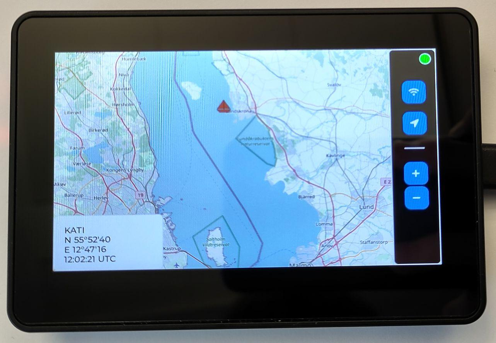

# Where is My Boat?

Ever wondered where your boat is? With this handy program, you can track your boat's current location and display it right on the touch screen of your ESP32!

**Features**

* **Live AIS Tracking**: Retrieves your boat's AIS (Automatic Identification System) position from [aisstream.io](https://aisstream.io/) (via WebSocketSecure).
* **Dynamic Mapping**: Fetches map tiles from  [OpenStreetMap](https://www.openstreetmap.org) for your boat’s location, converting PNGs using the efficient [Pngle](https://github.com/kikuchan/pngle) library
* **Interactive Display**: Displays the map on a  [4.3" TouchScreen](https://www.waveshare.com/esp32-s3-touch-lcd-4.3.htm) or [this one](https://www.waveshare.com/esp32-s3-touch-lcd-4.3b.htm) powered by the versatile [LVGL](https://lvgl.io/) graphics library.

This program combines real-time tracking and intuitive visuals to keep your boat's location just a glance away. Perfect for tech-savvy mariners!

# Setup

1. Checkout repository: `git clone --recurse-submodules https://github.com/arnegue/WhereIsMyBoat`
2. Open this Repository with VSCode
3. Install [ESP-IDF extension](https://marketplace.visualstudio.com/items?itemName=espressif.esp-idf-extension)
4. Install [C/C++ Extension Pack](https://marketplace.visualstudio.com/items?itemName=ms-vscode.cpptools-extension-pack)
5. Setup your ESP
6. Setup [main/config.h](main/config.h)
    1. (Free) [API-Key from aisstream.io](https://aisstream.io/apikeys) (need to be signed in)
    2. Ship's MMSI
7. Build and upload

# TODOs

* Downloading
    * add a http buffer to each tile, to download and convert tiles in parallel
    * If new tiles get downloaded because of new position but inbetween the zoom changes, tiles may will get downloaded simultaneously
        * Use callbacks (mutex!) for zoom changes and new ais position (-> new thread?)
* Wifi
    * WiFi reconnection
    * Connecting to Android AP not working?
    * Put WiFi-state in screen (also in initial connect)
* Put setup error in a label
* Maybe put a frame around tiles to only download 2*3 instead of 2*4 tile
